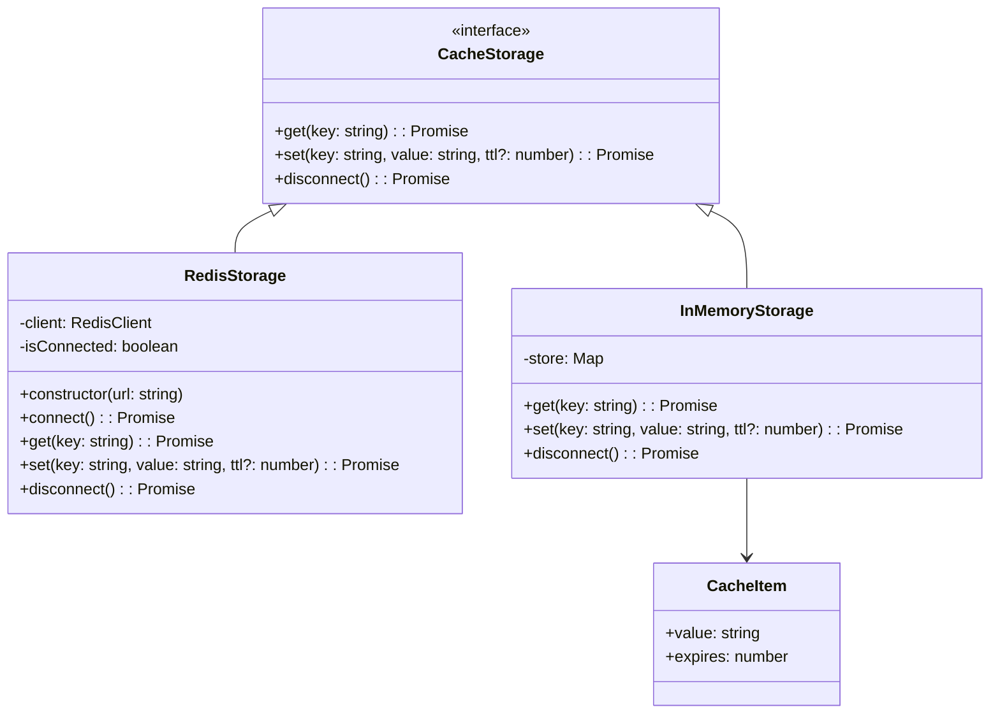
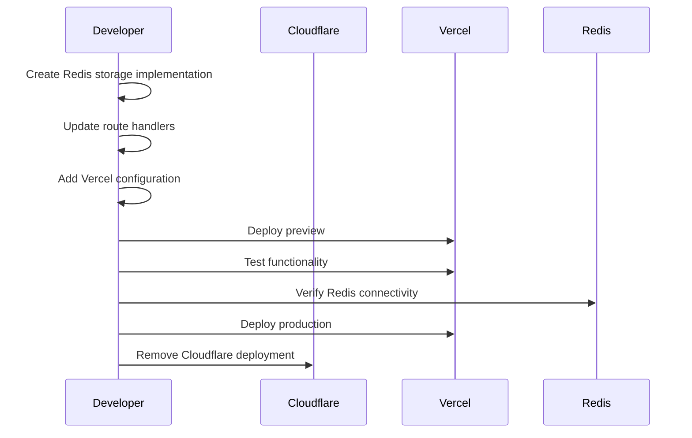

# Design for Cloudflare to Vercel Migration

## Architecture Overview

```mermaid
graph TB
    subgraph "Vercel Platform"
        VF[Vercel Function<br/>Fixed Region: iad1]
        ENV[Environment Variables]
    end
    
    subgraph "External Services"
        REDIS[Redis Cloud<br/>TLS Connection]
        OPENAI[OpenAI API<br/>Direct Connection]
    end
    
    subgraph "Application Layer"
        RR[React Router v7<br/>SSR]
        API[/api/completion<br/>Route Handler]
        CACHE[Cache Layer<br/>Abstraction]
    end
    
    CLIENT[Web Client] --> RR
    RR --> VF
    API --> CACHE
    CACHE --> REDIS
    API --> OPENAI
    VF --> ENV
```

## Component Design

### 1. Storage Layer Architecture



### 2. Simplified Redis Implementation

```typescript
// app/lib/cache/redis-storage.ts
import { createClient, RedisClientType } from 'redis';

// Global instance for connection reuse (Vercel Fluid Compute optimization)
let globalRedisClient: RedisClientType | null = null;

export async function getRedisClient(): Promise<RedisClientType> {
  if (globalRedisClient?.isReady) {
    return globalRedisClient;
  }

  const client = createClient({
    url: process.env.REDIS_URL,
    socket: {
      connectTimeout: 10000,
      keepAlive: 5000,
    },
  });

  client.on('error', (err) => {
    console.error('Redis Client Error:', err);
  });

  await client.connect();
  globalRedisClient = client;
  
  return client;
}

// Simplified cache functions
export async function getCached(key: string): Promise<string | null> {
  try {
    const client = await getRedisClient();
    return await client.get(key);
  } catch (error) {
    console.error('Redis get error:', error);
    return null;
  }
}

export async function setCached(key: string, value: string, ttl: number = 604800): Promise<void> {
  try {
    const client = await getRedisClient();
    await client.set(key, value, { EX: ttl });
  } catch (error) {
    console.error('Redis set error:', error);
    // Fail silently for cache writes
  }
}
```

### 3. Local Development Setup with Docker Compose

```yaml
# compose.yaml
services:
  redis:
    image: redis:7-alpine
    ports:
      - "6379:6379"
    volumes:
      - redis_data:/data
    command: redis-server --appendonly yes

volumes:
  redis_data:
```

### 4. Simplified Environment Configuration

```bash
# .env.local (for local development)
OPENAI_API_KEY=sk-...
REDIS_URL=redis://localhost:6379

# .env.production (template only - actual values in Vercel dashboard)
# OPENAI_API_KEY=
# REDIS_URL=
```

### 5. Route Handler Refactoring

```typescript
// app/routes/api.completion.tsx
import { getCached, setCached } from "~/lib/cache/redis-storage";
import { generateCacheKey } from "~/lib/cache/hash";
import { createOpenAI } from "@ai-sdk/openai";
import { streamText } from "ai";

export async function action({ request }: ActionFunctionArgs) {
  const openai = createOpenAI({
    apiKey: process.env.OPENAI_API_KEY!,
  });

  const { prompt, sourceLang, targetLang } = await request.json();
  const cacheKey = await generateCacheKey(prompt, sourceLang, targetLang);
  
  // Check cache
  const cached = await getCached(cacheKey);
  if (cached) {
    return createDataStreamResponse(cached);
  }

  // Stream new translation
  const result = streamText({
    model: openai("gpt-4o-mini"),
    prompt: `Translate from ${sourceLang} to ${targetLang}: ${prompt}`,
    onFinish: async ({ text }) => {
      // Cache the result
      await setCached(cacheKey, text);
    },
  });

  return result.toDataStreamResponse();
}
```

### 5. Vercel Configuration

```json
// vercel.json
{
  "$schema": "https://openapi.vercel.sh/vercel.json",
  "regions": ["iad1"],
  "framework": null,
  "buildCommand": "npm run build",
  "outputDirectory": "build",
  "env": {
    "NODE_ENV": "production"
  }
}
```

### 7. Project Structure Changes

```
web-translator/
├── app/
│   ├── lib/
│   │   └── cache/
│   │       ├── redis-storage.ts  # Simple Redis functions
│   │       └── hash.ts          # Existing hash logic
│   └── routes/
│       └── api.completion.tsx    # Updated route handler
├── compose.yaml                  # Docker Compose for local Redis
├── vercel.json                   # Vercel configuration
├── react-router.config.ts        # React Router config with Vercel preset
├── .env.local                    # Local development env
├── .env.production              # Production env template
└── package.json                 # Updated dependencies
```

## Vercel Best Practices Implementation

### 1. Environment Variable Management

```typescript
// app/lib/config/env.ts
export interface AppConfig {
  // Server-side only variables (never expose to client)
  OPENAI_API_KEY: string;
  REDIS_URL: string;
  
  // Vercel system variables
  VERCEL_ENV?: 'production' | 'preview' | 'development';
  VERCEL_URL?: string;
  
  // Application settings
  NODE_ENV: 'development' | 'production' | 'test';
}

export function getConfig(): AppConfig {
  // Validate required environment variables
  const required = ['OPENAI_API_KEY', 'REDIS_URL'];
  for (const key of required) {
    if (!process.env[key]) {
      throw new Error(`Missing required environment variable: ${key}`);
    }
  }
  
  return {
    OPENAI_API_KEY: process.env.OPENAI_API_KEY!,
    REDIS_URL: process.env.REDIS_URL!,
    VERCEL_ENV: process.env.VERCEL_ENV as any,
    VERCEL_URL: process.env.VERCEL_URL,
    NODE_ENV: (process.env.NODE_ENV as AppConfig['NODE_ENV']) || 'development',
  };
}
```

### 2. Redis Connection with Vercel KV Pattern

```typescript
// app/lib/cache/redis-storage.ts
import { createClient, RedisClientType } from 'redis';

// Global instance for connection reuse (Vercel Fluid Compute optimization)
let globalRedisClient: RedisClientType | null = null;

export class RedisStorage implements CacheStorage {
  private client: RedisClientType | null = null;

  constructor(private url: string) {
    // Reuse global client if available (Fluid Compute)
    if (globalRedisClient?.isReady) {
      this.client = globalRedisClient;
    }
  }

  private async ensureConnected(): Promise<RedisClientType> {
    if (this.client?.isReady) return this.client;
    
    // Create new client with keepalive enabled
    this.client = createClient({ 
      url: this.url,
      socket: {
        keepAlive: 5000,
        connectTimeout: 10000,
      }
    });
    
    this.client.on('error', (err) => {
      console.error('Redis Client Error:', err);
      // Don't throw - fail gracefully for cache operations
    });
    
    await this.client.connect();
    
    // Store globally for reuse
    if (!globalRedisClient) {
      globalRedisClient = this.client;
    }
    
    return this.client;
  }

  // ... rest of implementation
}
```

### 3. React Router v7 with Vercel Preset

```typescript
// react-router.config.ts
import { reactRouter } from "@react-router/dev/vite";
import { vercelPreset } from "@vercel/react-router/vite";
import type { Config } from "@react-router/dev/config";

export default {
  ssr: true,
  presets: [vercelPreset()],
} satisfies Config;
```

### 4. Enhanced Vercel Configuration

```json
// vercel.json
{
  "$schema": "https://openapi.vercel.sh/vercel.json",
  "regions": ["iad1"],
  "framework": null,
  "buildCommand": "npm run build",
  "outputDirectory": "build",
  "env": {
    "NODE_ENV": "production"
  },
  "functions": {
    "app/routes/api.completion.tsx": {
      "maxDuration": 30
    }
  },
  "headers": [
    {
      "source": "/api/(.*)",
      "headers": [
        {
          "key": "Cache-Control",
          "value": "no-store, max-age=0"
        }
      ]
    }
  ]
}
```

### 5. Environment Files Structure

```bash
# .env.local (for local development)
OPENAI_API_KEY=sk-...
REDIS_URL=redis://localhost:6379

# .env.production (template only - actual values in Vercel dashboard)
# OPENAI_API_KEY=
# REDIS_URL=
```

### 6. Deployment Scripts

```json
// package.json
{
  "scripts": {
    "dev": "react-router dev",
    "build": "react-router build",
    "start": "react-router-serve ./build/server/index.js",
    "deploy": "pnpm exec vercel --prod",
    "deploy:preview": "pnpm exec vercel",
    "env:pull": "pnpm exec vercel env pull .env.local",
    "env:add": "pnpm exec vercel env add"
  }
}
```

### 7. Entry Server Handling

According to Vercel documentation, we have two options:

**Option 1: Remove custom entry.server.tsx (Recommended)**
- Vercel provides a default implementation optimized for streaming on Vercel Functions
- Simply delete `app/entry.server.tsx` and let Vercel handle it
- This is the simplest approach and ensures compatibility

**Option 2: Update to use Vercel's handler**
```typescript
// app/entry.server.tsx
import { handleRequest } from '@vercel/react-router/entry.server';
import type { AppLoadContext, EntryContext } from 'react-router';

export default async function (
  request: Request,
  responseStatusCode: number,
  responseHeaders: Headers,
  routerContext: EntryContext,
  loadContext?: AppLoadContext,
): Promise<Response> {
  // Use Vercel's optimized handler
  return handleRequest(
    request,
    responseStatusCode,
    responseHeaders,
    routerContext,
    loadContext,
  );
}
```

**Decision: Use Option 1** - Remove the custom entry.server.tsx file since:
- The current implementation doesn't add any Cloudflare-specific functionality
- Vercel's default is already optimized for their platform
- Reduces maintenance and potential compatibility issues

## Migration Sequence



## Error Handling Strategy

1. **Redis Connection Failures**: Fall back to direct API calls without caching
2. **OpenAI API Errors**: Return user-friendly error messages
3. **Region Blocking**: Not possible due to fixed region deployment

## Performance Optimizations

1. **Connection Pooling**: Redis client maintains persistent connection
2. **Lazy Connection**: Connect to Redis only when first cache operation occurs
3. **In-Memory Fallback**: For local development and Redis failures

## Security Considerations

1. **Environment Variables**: All secrets stored in Vercel dashboard
2. **TLS Connection**: Redis URL includes SSL/TLS
3. **No Hardcoded Values**: Configuration through environment only

## Security Best Practices

1. **Environment Variables**: 
   - Mark all secrets as "Sensitive" in Vercel dashboard
   - Never commit `.env.local` or `.env.production` with actual values
   - Use `vercel env pull` to sync local environment safely

2. **Access Control**:
   - Server-side only access to sensitive variables
   - No client-side exposure of API keys
   - Validate all required variables on startup

3. **Connection Security**:
   - Redis TLS/SSL connection enforced
   - Connection timeout and retry logic
   - Graceful degradation on connection failure