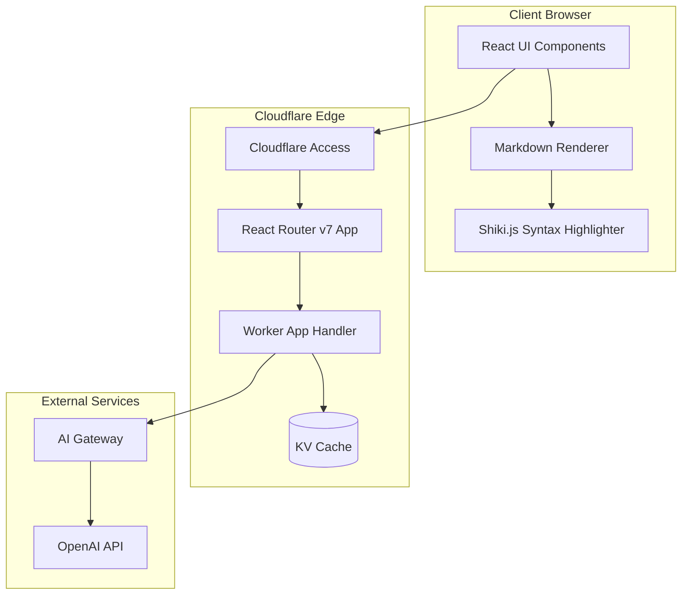
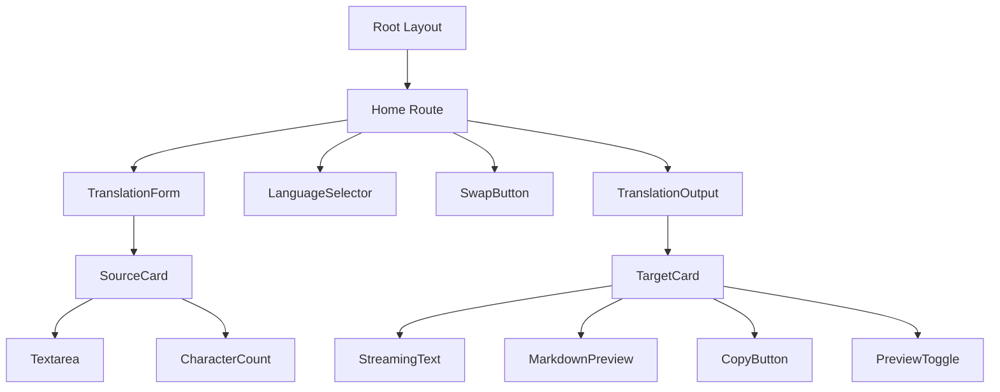
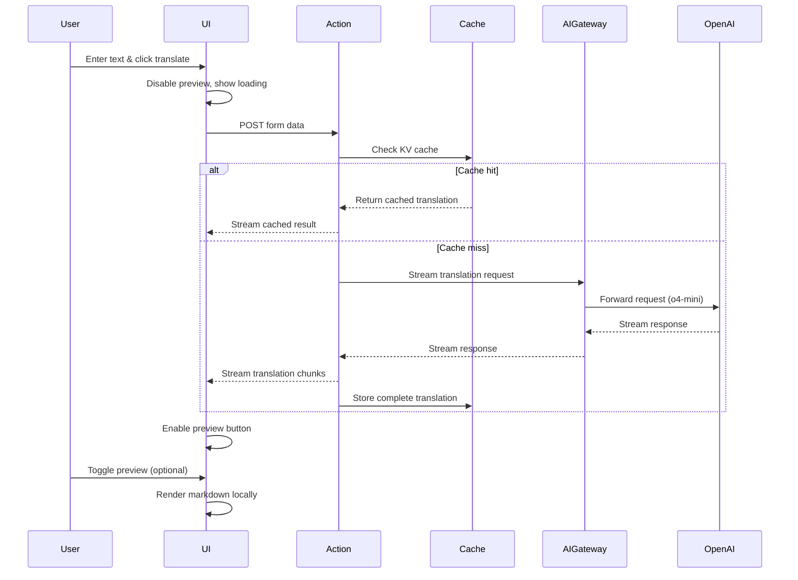

# Design Document: Web Translator Migration to React Router v7

## Executive Summary

This design document outlines the migration of a v0-generated web translator prototype from Next.js to React Router v7 on Cloudflare Workers. The primary focus is preserving the elegant visual design and user experience of the v0 prototype while implementing the technical architecture for improved performance and scalability.

## 1. System Architecture Overview



## 2. Component Architecture

### 2.1 Route Structure
```
/
└── routes/
    ├── _index.tsx (Main translation interface)
    └── api.completion.tsx (AI SDK streaming endpoint)
```

### 2.2 Component Hierarchy


### 2.3 Component Responsibilities

| Component | Responsibility |
|-----------|---------------|
| Root Layout | Theme provider, global styles, dark mode support |
| Home Route | Main translation logic, action handler, streaming response |
| TranslationForm | Source text input, language selection, submit handling |
| TranslationOutput | Display streaming/completed translation, preview toggle |
| MarkdownPreview | Client-side markdown rendering with Shiki.js |

## 3. Data Flow Design

### 3.1 Translation Request Flow


### 3.2 State Management
```typescript
interface TranslationState {
  sourceText: string;
  sourceLang: 'en' | 'ja';
  targetLang: 'en' | 'ja';
  translatedText: string;
  isTranslating: boolean;
  isStreaming: boolean;
  showPreview: boolean;
  error: string | null;
}
```

## 4. API Design

### 4.1 API Routes

#### Translation Endpoint (/api/completion)
The AI SDK requires a dedicated API endpoint that returns streaming responses in the expected format. This endpoint handles caching and streaming using the AI SDK's built-in utilities.

```typescript
// Route: /api/completion (handled by app/routes/api.completion.tsx)
// Method: POST
// Body: { prompt: string, sourceLang: string, targetLang: string }
// Response: AI SDK streaming format (via toDataStreamResponse())
```

### 4.2 AI Gateway Configuration
```typescript
const openai = createOpenAI({
  apiKey: env.OPENAI_API_KEY,
  baseURL: `https://gateway.ai.cloudflare.com/v1/${env.CF_ACCOUNT_ID}/${env.AI_GATEWAY_ID}/openai`
});
```

## 5. Streaming Implementation (Simplified with ai-sdk/react)

### Benefits of Using @ai-sdk/react
1. **Automatic State Management**: No manual state handling for streaming text
2. **Built-in Loading States**: `isLoading` property tracks streaming status
3. **Error Handling**: Automatic error state management
4. **Form Integration**: `handleSubmit` works seamlessly with React forms
5. **Simplified Streaming**: No manual EventSource or ReadableStream handling
6. **Type Safety**: Full TypeScript support out of the box

### 5.1 Server-Side API Route
```typescript
// app/routes/api.completion.tsx
import { streamText } from 'ai';
import { openai } from '@ai-sdk/openai';
import type { Route } from '../+types.root';

export async function action({ request, context }: Route.ActionArgs) {
  const { prompt, sourceLang, targetLang } = await request.json();
  const env = context.cloudflare.env;
  
  // Check cache first
  const cacheKey = generateCacheKey(prompt, sourceLang, targetLang);
  const cached = await env.TRANSLATION_CACHE.get(cacheKey);
  
  if (cached) {
    // Return cached result as a stream
    return new Response(cached, {
      headers: { 'Content-Type': 'text/plain; charset=utf-8' }
    });
  }
  
  // Configure AI Gateway
  const ai = createOpenAI({
    apiKey: env.OPENAI_API_KEY,
    baseURL: `https://gateway.ai.cloudflare.com/v1/${env.CF_ACCOUNT_ID}/${env.AI_GATEWAY_ID}/openai`
  });
  
  // Stream new translation
  const result = await streamText({
    model: ai('o4-mini'),
    messages: [
      {
        role: 'system',
        content: `You are a professional translator. Translate the following text from ${sourceLang} to ${targetLang}. 
                 Preserve all markdown formatting, code blocks, and special characters exactly as they appear.
                 Provide only the translation without any explanations or notes.`
      },
      { role: 'user', content: prompt }
    ],
    temperature: 0.3,
    maxTokens: 4096,
    // Important: This onFinish callback caches the complete translation
    onFinish: async ({ text }) => {
      await env.TRANSLATION_CACHE.put(cacheKey, text, { expirationTtl: 604800 });
    },
  });
  
  // Return the stream in AI SDK format
  return result.toDataStreamResponse();
}
```

### 5.2 Client-Side Component (Simplified with useCompletion)
```typescript
// app/routes/_index.tsx
import { useCompletion } from '@ai-sdk/react';
import { useState } from 'react';

export default function TranslatorPage() {
  const [sourceLang, setSourceLang] = useState<'en' | 'ja'>('en');
  const [targetLang, setTargetLang] = useState<'en' | 'ja'>('ja');
  const [showPreview, setShowPreview] = useState(false);
  
  const {
    completion,      // The streaming/completed translation text
    input,          // The source text input value
    setInput,       // Update source text
    handleSubmit,   // Form submission handler
    isLoading,      // True while streaming
    stop,           // Stop streaming
    error,          // Error state
  } = useCompletion({
    api: '/api/completion',
    // Send language params with the request
    body: {
      sourceLang,
      targetLang,
    },
    // Disable preview when starting new translation
    onStart: () => {
      setShowPreview(false);
    },
    // Handle errors gracefully
    onError: (error) => {
      console.error('Translation error:', error);
    },
  });
  
  const handleSwapLanguages = () => {
    setSourceLang(targetLang);
    setTargetLang(sourceLang);
    setInput(completion); // Move translation to source
  };
  
  return (
    <form onSubmit={handleSubmit} className="flex flex-col gap-4">
      <div className="flex gap-4">
        {/* Source Card */}
        <Card className="flex-1 border-blue-500">
          <CardHeader>
            <Select value={sourceLang} onValueChange={setSourceLang}>
              <SelectTrigger>
                <SelectValue />
              </SelectTrigger>
              <SelectContent>
                <SelectItem value="en">English</SelectItem>
                <SelectItem value="ja">Japanese</SelectItem>
              </SelectContent>
            </Select>
          </CardHeader>
          <CardContent>
            <Textarea
              value={input}
              onChange={(e) => setInput(e.target.value)}
              placeholder="Enter text to translate..."
              className="min-h-[200px]"
            />
          </CardContent>
          <CardFooter>
            <span className="text-sm text-muted-foreground">
              {input.length} characters
            </span>
          </CardFooter>
        </Card>
        
        {/* Target Card */}
        <Card className="flex-1 border-purple-500">
          <CardHeader>
            <Select value={targetLang} onValueChange={setTargetLang}>
              <SelectTrigger>
                <SelectValue />
              </SelectTrigger>
              <SelectContent>
                <SelectItem value="en">English</SelectItem>
                <SelectItem value="ja">Japanese</SelectItem>
              </SelectContent>
            </Select>
          </CardHeader>
          <CardContent>
            {showPreview && !isLoading ? (
              <MarkdownPreview content={completion} />
            ) : (
              <div className="whitespace-pre-wrap min-h-[200px]">
                {completion}
              </div>
            )}
          </CardContent>
          <CardFooter className="justify-between">
            <span className="text-sm text-muted-foreground">
              {completion.length} characters
            </span>
            <div className="flex gap-2">
              <Button
                type="button"
                variant="ghost"
                size="sm"
                onClick={() => setShowPreview(!showPreview)}
                disabled={isLoading || !completion}
              >
                <Eye className="h-4 w-4" />
                Preview
              </Button>
              <Button
                type="button"
                variant="ghost"
                size="sm"
                onClick={() => navigator.clipboard.writeText(completion)}
                disabled={!completion}
              >
                <Copy className="h-4 w-4" />
                Copy
              </Button>
            </div>
          </CardFooter>
        </Card>
      </div>
      
      {/* Action Buttons */}
      <div className="flex justify-center gap-4">
        <Button
          type="button"
          variant="ghost"
          onClick={handleSwapLanguages}
          disabled={isLoading}
        >
          <ArrowLeftRight className="h-4 w-4" />
          Swap
        </Button>
        
        <Button type="submit" disabled={isLoading || !input.trim()}>
          {isLoading ? (
            <Loader2 className="h-4 w-4 animate-spin" />
          ) : (
            <>
              翻訳する
              <ArrowRight className="ml-2 h-4 w-4" />
            </>
          )}
        </Button>
      </div>
      
      {error && (
        <Alert variant="destructive">
          <AlertDescription>{error.message}</AlertDescription>
        </Alert>
      )}
    </form>
  );
}
```

## 6. UI/UX Design (Preserving v0 Prototype)

### 6.1 Visual Design Specifications

Based on the v0 prototype screenshot, the design features:

#### Color Palette
- **Background**: Deep blue-black gradient (#0a0a1a to #1a1a2e)
- **Primary Accent (Source)**: Blue border/highlight (#3b82f6)
- **Secondary Accent (Target)**: Purple border/highlight (#8b5cf6)
- **Card Background**: Semi-transparent dark (#ffffff08)
- **Text Primary**: White (#ffffff)
- **Text Secondary**: Muted gray (#9ca3af)

#### Layout Structure
- **Container**: Centered with max-width, fixed padding
- **Card Layout**: Two equal-width cards side by side
- **Card Spacing**: Consistent gap between cards
- **Desktop-only**: No mobile considerations

#### Component Styling

**Language Selector Cards**
- Integrated dropdown in card header
- Clean select styling with down arrow indicator
- Full-width within card header

**Text Areas**
- Large, prominent text input areas
- Minimal styling to focus on content
- Consistent padding and font sizing
- Auto-expanding height with min-height constraint

**Character Count**
- Bottom of each card
- Muted text color
- Format: "X characters" (not localized)

**Action Buttons**
- **Translate Button**: 
  - Centered below cards
  - Gradient background (blue to purple)
  - Japanese text "翻訳する" with arrow icon
  - Loading state: spinner replaces text completely
- **Preview/Copy Buttons**:
  - Icon-only buttons in target card
  - Ghost variant (transparent background)
  - Subtle hover effects

#### Typography
- **Font Family**: System font stack (sans-serif)
- **Heading Size**: Not visible in main interface
- **Body Text**: 16px base size
- **Character Count**: 14px, muted color

### 6.2 Interaction Design

#### Translation Flow
1. **Initial State**
   - Empty target area
   - Preview button disabled (grayed out)
   - Translate button active with "翻訳する →" text

2. **During Translation**
   - Translate button shows only loading spinner (no text)
   - Preview automatically turns off
   - Preview button remains disabled
   - Translation text streams into target area

3. **Translation Complete**
   - Translate button returns to normal state
   - Preview button becomes active
   - Character count updates in real-time

#### User Interactions
- **Language Swap**: Swaps content and languages between cards
- **Copy Button**: Shows brief feedback (checkmark or toast)
- **Preview Toggle**: Switches between raw text and rendered markdown
- **Dark Mode Toggle**: In top-right corner (if implemented)

### 6.3 Layout Specifications

#### Desktop-Only Design
- Fixed minimum viewport width (1024px recommended)
- Side-by-side card layout with consistent spacing
- Optimized for desktop browsers only
- No mobile breakpoints or responsive adjustments needed

## 7. Caching Strategy

### 7.1 Cache Key Generation
```typescript
function generateCacheKey(text: string, source: string, target: string): string {
  const normalized = text.trim().toLowerCase();
  const hash = btoa(normalized).replace(/[^a-zA-Z0-9]/g, '');
  return `translate:${source}:${target}:${hash}`;
}
```

### 7.2 Cache Policy
- TTL: 7 days (604,800 seconds)
- Store only complete translations
- No partial/streaming cache
- Key includes normalized text + language pair

## 8. Security Design

### 8.1 Cloudflare Access Integration
```typescript
// Configured via Cloudflare Dashboard
// Application: web-translator.{domain}
// Policy: Email equals {user@email.com}
// No code changes required - handled at CF edge
```

### 8.2 Secret Management
```bash
# Stored as Worker secrets
wrangler secret put OPENAI_API_KEY
wrangler secret put CF_ACCOUNT_ID
wrangler secret put AI_GATEWAY_ID
```

## 9. Testing Strategy

### 9.1 Test Structure
```typescript
// app/routes/_index.test.tsx
import { createRoutesStub } from "react-router";
import { render, screen, userEvent } from "@testing-library/react";

describe("Translation Feature", () => {
  test("successful translation", async () => {
    const Stub = createRoutesStub([{
      path: "/",
      Component: HomeRoute,
      action: () => ({
        translation: "こんにちは",
        error: null
      })
    }]);
    
    render(<Stub />);
    await userEvent.type(screen.getByRole('textbox'), 'Hello');
    await userEvent.click(screen.getByText('Translate'));
    
    expect(await screen.findByText('こんにちは')).toBeInTheDocument();
  });
  
  test("translation error handling", async () => {
    // Test error scenarios
  });
});
```

## 10. Technology Rationale

| Choice | Rationale |
|--------|-----------|
| React Router v7 | Modern framework with built-in streaming, Cloudflare support |
| Cloudflare Workers | Edge computing, KV storage, AI Gateway integration |
| Vercel AI SDK | Best-in-class streaming support, OpenAI integration |
| @ai-sdk/react | Simplifies streaming implementation with `useCompletion` hook, handles state management |
| Shiki.js | Performant syntax highlighting, wide language support |
| shadcn/ui | Consistent with existing prototype, accessible components |
| Biome | Fast, all-in-one tool for linting and formatting (replaces ESLint + Prettier) |
| pnpm | Fast, efficient package manager with better disk space usage than npm |

## 11. Performance Optimizations

1. **Edge Caching**: KV storage at edge locations
2. **Streaming**: Progressive rendering reduces perceived latency
3. **Client-side Preview**: No server round-trip for markdown rendering
4. **Static Assets**: Served directly from Cloudflare CDN
5. **Code Splitting**: Shiki.js loaded only when preview is used

## 12. Migration Considerations

### From Next.js to React Router v7:
- Replace `app/page.tsx` with `app/routes/_index.tsx`
- Convert Next.js App Router to React Router file-based routing
- Replace Next.js API routes with React Router actions
- Maintain existing Tailwind styles and shadcn/ui components
- Preserve dark mode functionality through theme provider